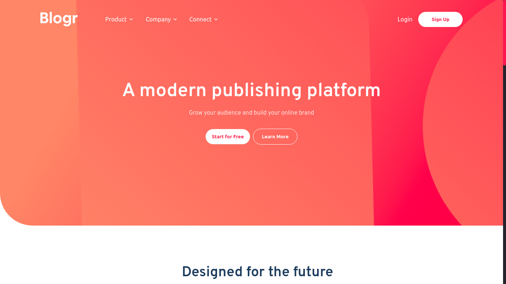
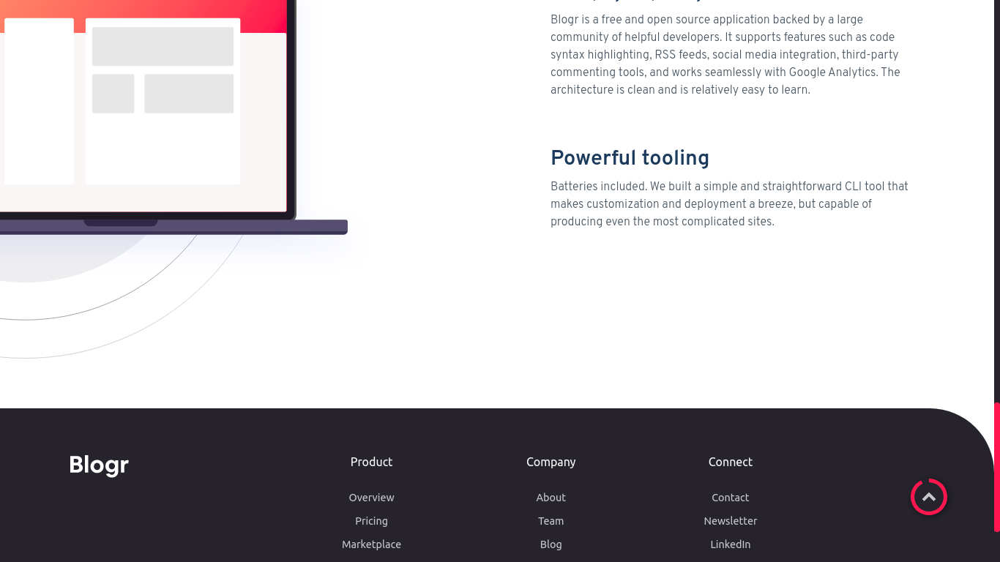

<div align="center">
  
  <h1>Blog Landing Page</h1>
  <h4>Challenge from <a href="https://www.frontendmentor.io/home">Frontend Mentor</a></h4>
  <div align="center">
    <p>
      <a href="https://blogr-landing-page-indol.vercel.app/">Preview</a> ·
      <a href="https://github.com/DanteBenicio/blogr-landing-page-react/issues">Report Bug</a> ·
      <a href="https://github.com/DanteBenicio/blogr-landing-page-react/pulls">Request Feature</a>
    </p>
  </div>

   [](https://blogr-landing-page-indol.vercel.app/)

   <p>
    
    
   </p>
</div>


## ❔ About this Project

Project created from [Frontend&nbsp;Mentor](https://www.frontendmentor.io/home).

This project was developed by me [DanteBenicio](https://github.com/DanteBenicio).

Blogr Landing Page, is a software created to management your website, blog content on a easy way of maintanence.


## ✨ Tecnologies

- [React](https://pt-br.reactjs.org/)
- [Scss/Sass](https://sass-lang.com/)
- [Typescript](https://www.typescriptlang.org/)
- [Vite](https://vitejs.dev/)


## 🚀 Run the project

```bash
# Clone the project from Github
git clone https://github.com/DanteBenicio/blogr-landing-page-react

# Access the project folder
cd blogr-landing-page-react

# Install the project dependencies
yarn
or
npm install

# Run the project (port 3000 - http://localhost:3000)
yarn dev
or
npm run dev
```
